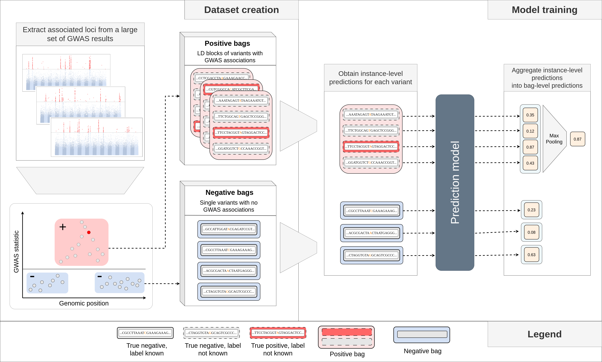

# Multiple Instance Fine-mapping (MIFM)
*"Multiple instance fine-mapping: predicting causal regulatory variants with a deep sequence model"*




This repository contains:
- a script for training an MIFM model: [src/train.py](src/train.py)
- weights for an already trained model used for the experiments in the paper: [checkpoints/a7a0q7ar.ckpt](checkpoints/a7a0q7ar.ckpt)
- a script for making predictions using a pretrained model: [src/load_and_predict.py](src/load_and_predict.py)
- example files for the prediction script: [example_data](example_data)

## Predicting using a pretrained model:
To predict based on genomic coordinates (chromosome and bp location):
```
python src/load_and_predict.py \
  --out_file=out.txt \
  --coordinates_file=example_data/variant_coordinates.tsv
```

To predict directly from DNA sequences (as strings):
```
python src/load_and_predict.py \
  --out_file=out.txt \
  --sequences_file=example_data/sequences.csv
```
